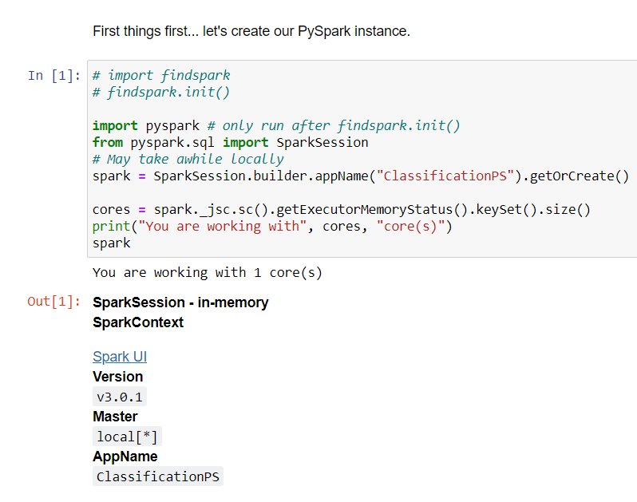
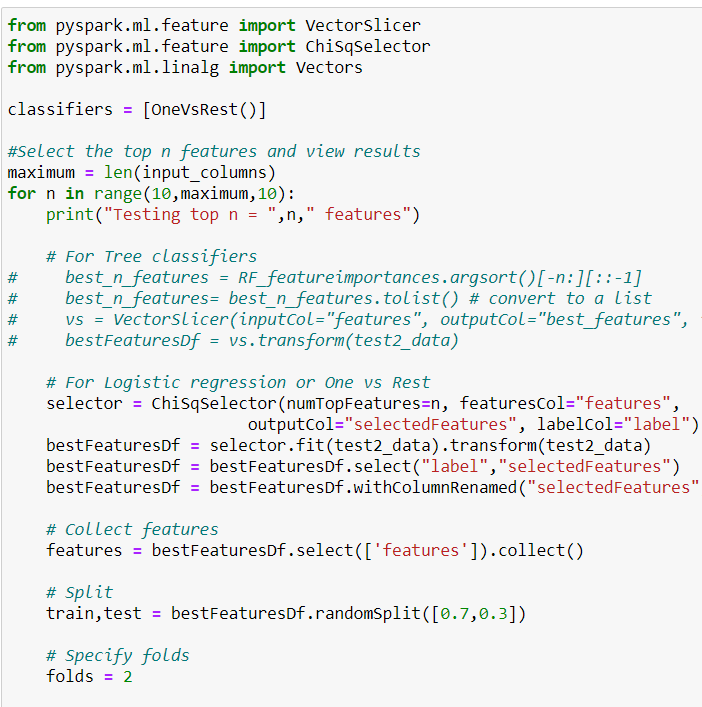
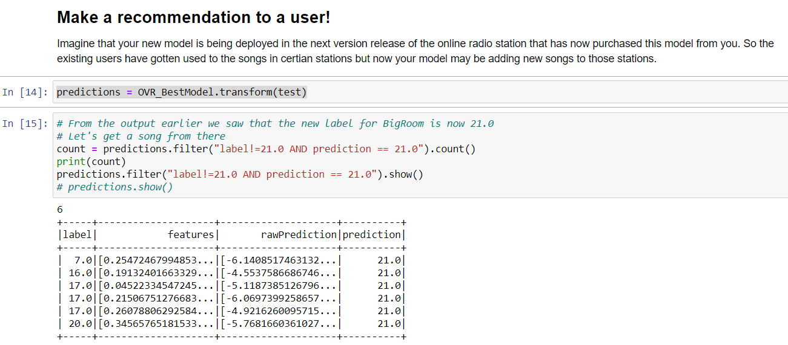

# Song-Genre-Classification-in-PySparks-MLlib
A PySpark MLlib classification model to classify songs based on a number of characteristics into a set of 23 electronic genres.  
This technology could be used by an application like Pandora to recommend songs to users or just create meaningful channels. Super fun!  
 
Dataset  
Each row is an electronic music song. The dataset contains 100 song for each genre among 23 electronic music genres, they were the top (100) songs of their genres on November 2016. The 71 columns are audio features extracted of a two random minutes sample of the file audio. These features have been extracted using pyAudioAnalysis.  

Firstly, I created an algorithm that classifies songs into the 23 genres provided. Then I tested out several different models and select the highest performing one. Also I played around with the feature selection methods and finally tried to make a recommendation for any user. 
 
## My approach
I decided to approach this analysis in 4 main steps.
 
1] Create Baseline: Train and evaluate models on raw data without pre-treating it for outliers, skewness or negative values. This way we can clearly see what effect our transformations have on our analysis.  

2] Test treatments: Train and evaluate models on treated data (outliers, skewness and negative values) and compare to baseline.  

3] Feature Selection: Select the best performing models from the previous two approaches and perform feature selection on it to fine tune it.  

4] Make a recommendation to a user: Create a scrip to make a recommendation to a user. I intentionally left this part of the project a bit ambiguous.  

